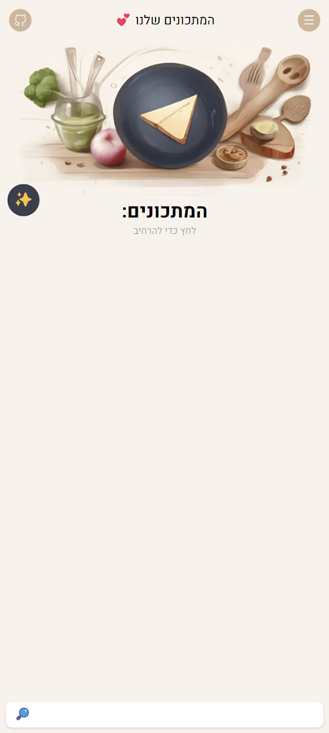
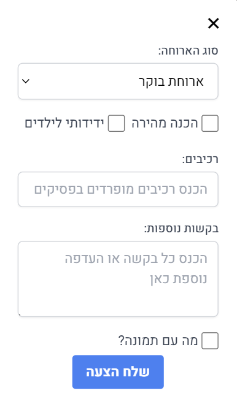
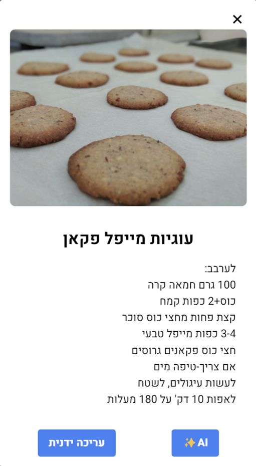
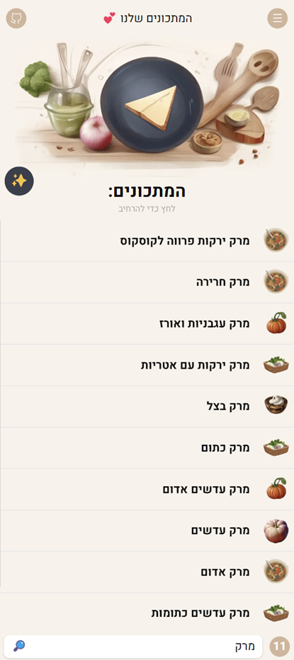

# Our Recipes

אפליקציית ניהול מתכונים משפחתית בעברית, הניזונה מערוץ טלגרם אחד.

Our Recipes is a Hebrew-first family recipe management app fed by a single
Telegram channel: free-text recipes posted (or edited) there are reformatted by
AI and appear in the app within seconds. The database is the source of truth;
the channel is the family's input surface.

## Demo










## Architecture

Full details: [docs/architecture/ARCHITECTURE.md](docs/architecture/ARCHITECTURE.md)
(implementation plan: [docs/architecture/IMPLEMENTATION_PLAN.md](docs/architecture/IMPLEMENTATION_PLAN.md)).

- **Next.js on Vercel** (`frontend/ourRecipesFront/`) — the UI **and** the entire API
  (App Router routes under `src/app/api`): recipes, menus, places, auth, AI features.
- **Managed PostgreSQL** (Neon / Supabase / Vercel Postgres) — the single source of
  truth, accessed via Prisma. Telegram is an input/display surface, not the memory
  of the system.
- **Telegram Bot API webhook** (`POST /api/webhooks/telegram`) — channel posts and
  edits are pushed into the app; no polling, no long-lived server.
- **App-authored content** — recipes created in the app live in the DB only;
  nothing is written back to Telegram.
- **`api-python/`** — a small FastAPI + Telethon service used only for history
  import/rebuild and periodic reconcile (Bot API cannot read channel history).
  Triggered by Vercel Cron via `/api/cron/reconcile`.
- **AI** — Gemini (recipe formatting, suggestions, menu planning, images).
- **Images** — Vercel Blob; the DB stores URLs only.
- **Auth** — Telegram Login Widget → JWT (httpOnly cookie, `jose`), edit
  permissions derived from channel admin rights via `getChatMember`.

## Local Development

Prerequisites: Node.js 20+, Docker (for local Postgres).

```bash
# 1. Start a local Postgres
docker compose up -d postgres

# 2. Install and configure the app
cd frontend/ourRecipesFront
npm install
cp .env.example .env.local   # fill in the values (see ARCHITECTURE.md §7)

# 3. Create the schema
npm run prisma:push

# 4. Run
npm run dev                  # serves on port 80
```

Tests and build:

```bash
npm run test:run   # vitest (all Telegram/DB access is mocked)
npm run build      # prisma generate + next build
```

Environment variables are listed in
[ARCHITECTURE.md §7](docs/architecture/ARCHITECTURE.md) and
`frontend/ourRecipesFront/.env.example`. Deployment and one-time setup steps
(webhook registration, history import) live in
[docs/architecture/DEPLOYMENT.md](docs/architecture/DEPLOYMENT.md).

## Repository Layout

| Path | Role |
|------|------|
| `frontend/ourRecipesFront/` | Next.js app — UI + all API routes |
| `api-python/` | FastAPI + Telethon: history import & reconcile |
| `docs/architecture/` | Architecture, implementation plan, deployment guide |
| `demo/` | Screenshots |

## License

See [LICENSE](LICENSE).
