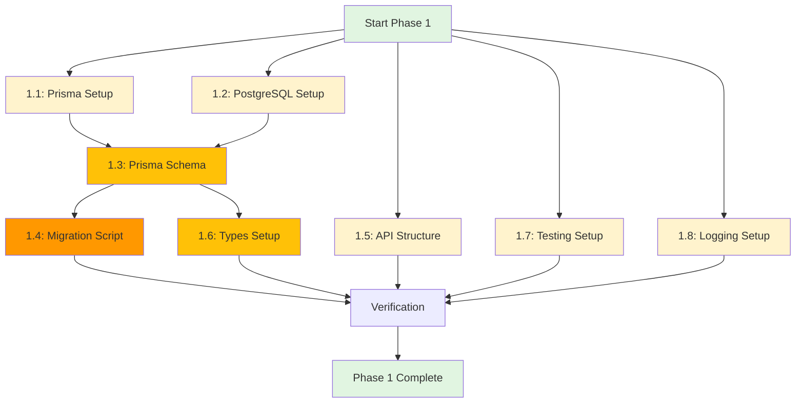

# 🏗️ Phase 1: Infrastructure Setup

**Timeline**: שבוע 1-2 (14-21 שעות)
**Status**: 📝 Planned
**Dependencies**: None (זהו השלב הראשון)

---

## 🎯 Phase Goals

להקים את כל התשתיות הדרושות למעבר מ-Flask ל-Next.js:
1. ✅ Database layer (Prisma + PostgreSQL)
2. ✅ API infrastructure (Next.js API Routes)
3. ✅ Type safety (TypeScript types)
4. ✅ Testing framework (Vitest)
5. ✅ Logging system (Pino)
6. ✅ Error handling framework

**קריטריון הצלחה כולל**:
- ניתן לקרוא/לכתוב ל-DB דרך Prisma ב-Next.js API route
- ניתן להריץ test ולקבל תוצאה
- Database מאוכלס בכל הdata מ-SQLite

---

## 📋 Tasks Overview

| Task ID | Name | Type | Est. Hours | Can Run in Parallel |
|---------|------|------|------------|---------------------|
| **1.1** | Prisma Setup | Setup | 2-3 | ✅ Start |
| **1.2** | PostgreSQL Setup | Setup | 1-2 | ✅ Parallel with 1.1 |
| **1.3** | Prisma Schema Creation | Code | 3-4 | ⚠️ After 1.1 |
| **1.4** | Migration Script | Code | 3-4 | ⚠️ After 1.3 |
| **1.5** | API Routes Structure | Code | 2-3 | ✅ Parallel with 1.3 |
| **1.6** | Types Setup | Code | 2-3 | ⚠️ After 1.3 |
| **1.7** | Testing Infrastructure | Setup | 3-4 | ✅ Parallel with 1.5 |
| **1.8** | Logging Setup | Setup | 1-2 | ✅ Parallel with 1.5 |

**Total**: 17-25 hours

---

## 🔀 Dependency Graph



### Legend:
- 🟢 **Green**: Start/End
- 🟡 **Light Yellow**: Can run in parallel (no dependencies)
- 🟠 **Orange/Dark Yellow**: Has dependencies (must wait)

---

## 🚀 Execution Strategy

### Wave 1: Foundation (Parallel Execution)
**יכולים לרוץ במקביל:**
```bash
# Agent 1
Task 1.1: Prisma Setup

# Agent 2
Task 1.2: PostgreSQL Setup

# Agent 3
Task 1.5: API Routes Structure

# Agent 4
Task 1.7: Testing Infrastructure

# Agent 5
Task 1.8: Logging Setup
```

**Estimated time**: 2-3 hours (with 5 parallel agents)

---

### Wave 2: Schema & Types (Sequential after Wave 1)
**תלוי ב-1.1 ו-1.2:**
```bash
# Must wait for 1.1 and 1.2
Task 1.3: Prisma Schema Creation
```

**Estimated time**: 3-4 hours

---

### Wave 3: Migration & Types (Parallel after Wave 2)
**תלוי ב-1.3:**
```bash
# Agent 1
Task 1.4: Migration Script

# Agent 2
Task 1.6: Types Setup
```

**Estimated time**: 3-4 hours (with 2 parallel agents)

---

### Wave 4: Verification (After all tasks)
```bash
# Single agent - verify everything works together
./scripts/verify-phase-1.sh
```

**Estimated time**: 1 hour

---

## 📊 Parallel vs Sequential Execution

### Option A: Full Parallel (5 agents)
```
Total time: ~8-12 hours
Resources: 5 AI agents or developers
Risk: Medium (integration issues)
```

### Option B: Sequential (1 agent)
```
Total time: ~17-25 hours
Resources: 1 AI agent or developer
Risk: Low (catch issues early)
```

### Option C: Hybrid (2-3 agents) ⭐ **RECOMMENDED**
```
Total time: ~10-15 hours
Resources: 2-3 AI agents or developers
Risk: Low-Medium
```

**Recommended approach:**
1. Wave 1: 2 agents (1.1+1.2 together, 1.5+1.7+1.8 together)
2. Wave 2: 1 agent (1.3)
3. Wave 3: 2 agents (1.4, 1.6)
4. Verify together

---

## 📝 Task Files

1. [**Task 1.1**: Prisma Setup](./tasks/task-1.1-prisma-setup.md) - הגדרה ראשונית
2. [**Task 1.2**: PostgreSQL Setup](./tasks/task-1.2-postgres-setup.md) - בחירה והקמת DB
3. [**Task 1.3**: Prisma Schema Creation](./tasks/task-1.3-schema-creation.md) - המרה מ-SQLAlchemy
4. [**Task 1.4**: Migration Script](./tasks/task-1.4-migration-script.md) - העברת data
5. [**Task 1.5**: API Routes Structure](./tasks/task-1.5-api-structure.md) - מבנה בסיסי
6. [**Task 1.6**: Types Setup](./tasks/task-1.6-types-setup.md) - TypeScript types
7. [**Task 1.7**: Testing Infrastructure](./tasks/task-1.7-testing-setup.md) - Vitest
8. [**Task 1.8**: Logging Setup](./tasks/task-1.8-logging-setup.md) - Pino logger

---

## ✅ Phase Success Criteria

**לפני מעבר ל-Phase 2, וודא:**

### Database:
- [ ] PostgreSQL database created and accessible
- [ ] Prisma schema matches SQLAlchemy models
- [ ] All data migrated successfully (0 data loss)
- [ ] Can query data via Prisma Studio

### API:
- [ ] Basic API route structure exists
- [ ] Error handling works
- [ ] Can create a simple GET endpoint
- [ ] Logging captures requests

### Testing:
- [ ] Vitest runs successfully
- [ ] Can write and run a simple test
- [ ] Test coverage setup works

### Types:
- [ ] Prisma types generated
- [ ] Shared types defined
- [ ] No TypeScript errors

### Verification:
```bash
npm run verify:phase-1
# Should output: ✅ All checks passed
```

---

## 🔄 Rollback Strategy

**If Phase 1 fails:**

1. **Database**: SQLite backup is intact (`recipes.db.backup`)
2. **Code**: Git branch can be deleted
3. **No impact**: Frontend still uses Flask API

**Safe to experiment!** זהו שלב setup בלבד, אין השפעה על production.

---

## 📚 Resources

- [Prisma Documentation](https://www.prisma.io/docs)
- [Next.js API Routes](https://nextjs.org/docs/app/building-your-application/routing/route-handlers)
- [Vitest](https://vitest.dev/)
- [Pino Logger](https://getpino.io/)

---

## 🤖 AI Agent Workflow

**For Claude Code or similar:**

### Sequential Execution (1 agent):
```bash
1. Read task-1.1-prisma-setup.md
2. Execute task 1.1
3. Read task-1.2-postgres-setup.md
4. Execute task 1.2
5. ... continue sequentially
```

### Parallel Execution (multiple agents):
```bash
# Agent 1:
Execute tasks: 1.1 → wait → 1.3 → 1.4

# Agent 2:
Execute tasks: 1.2 → wait → (nothing)

# Agent 3:
Execute tasks: 1.5, 1.7, 1.8 → wait → 1.6
```

---

**Next**: Pick a task and start implementing!

**Created**: 2025-11-22
**Last Updated**: 2025-11-22
