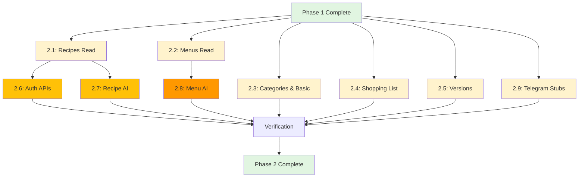

# 🚀 Phase 2: API Migration (Flask → Next.js)

**Timeline**: שבוע 2-3 (40-60 שעות)
**Status**: 📝 Planned
**Dependencies**: Phase 1 (Infrastructure must be complete)

---

## 🎯 Phase Goals

להעביר את **כל** ה-API endpoints מ-Flask ל-Next.js API Routes:
1. ✅ 59 endpoints סה"כ
2. ✅ קבוצה A: Read operations (קל - אין Telegram)
3. ✅ קבוצה B: Write operations - DB only (בינוני)
4. ✅ קבוצה C: AI integration (בינוני)
5. ⚠️ קבוצה D: Write with Telegram (קשה - דורש Phase 4!)

**קריטריון הצלחה כולל**:
- כל ה-endpoints עובדים ב-Next.js
- Tests עוברים (coverage >80%)
- Response time זהה או טוב יותר מ-Flask
- Frontend מחובר ל-Next.js API (לא Flask)

---

## 📊 API Endpoints Overview

**מתוך CURRENT_STATE.md - 59 endpoints:**

| Category | Total | Easy | Medium | Hard | Telegram Dep | AI Dep |
|----------|-------|------|--------|------|--------------|--------|
| **Recipes** | 12 | 3 | 6 | 3 | ✅ (2) | ✅ (6) |
| **Menus** | 15 | 4 | 7 | 4 | ✅ (4) | ✅ (1) |
| **Places** | 3 | 0 | 0 | 3 | ✅ (3) | ❌ |
| **Sync** | 5 | 0 | 1 | 4 | ✅ (5) | ❌ |
| **Categories** | 1 | 1 | 0 | 0 | ❌ | ❌ |
| **Versions** | 3 | 2 | 0 | 1 | ✅ (1) | ❌ |
| **Shopping List** | ~10 | 10 | 0 | 0 | ❌ | ❌ |
| **Auth** | 5 | 2 | 3 | 0 | ❌ | ❌ |
| **Basic** | 1 | 1 | 0 | 0 | ❌ | ❌ |
| **TOTAL** | 59 | 23 | 17 | 15 | 15 | 7 |

**Legend:**
- **Easy**: Simple CRUD, DB only, <100 lines
- **Medium**: Business logic, validation, 100-200 lines
- **Hard**: Complex logic, external deps, >200 lines

---

## 🎯 Migration Strategy

### Grouping by Dependencies

#### 🟢 Group A: Read Operations (Easy - No Dependencies)
**23 endpoints | Estimated: 12-16 hours**

**Can start immediately:**
- ✅ No Telegram dependency
- ✅ No AI dependency
- ✅ Only Prisma reads
- ✅ Straightforward conversion

**Endpoints:**
1. `GET /api/recipes/search` - Search recipes
2. `GET /api/recipes/search/suggestions` - Autocomplete
3. `GET /api/recipes/<telegram_id>` - Get recipe
4. `GET /api/recipes/manage` - List user recipes
5. `GET /api/menus` - List menus
6. `GET /api/menus/<id>` - Get menu
7. `GET /api/menus/shared/<token>` - Shared menu
8. `GET /api/categories` - List categories
9. `GET /api/versions/recipe/<id>` - Get versions
10. `GET /api/shopping-list/*` - All shopping list GETs
11. `GET /api/auth/validate` - Validate token
12. `GET /api/ping` - Health check

**Priority**: 🔴 High (foundation for frontend)

---

#### 🟡 Group B: Write Operations - DB Only (Medium - No External Deps)
**17 endpoints | Estimated: 14-18 hours**

**Can run after Group A:**
- ✅ No Telegram (just DB writes)
- ✅ No AI
- ⚠️ Validation needed
- ⚠️ Business logic

**Endpoints:**
1. `POST /api/versions/recipe/<id>` - Create version
2. `POST /api/shopping-list/*` - All shopping list writes
3. `PUT /api/shopping-list/*` - Update items
4. `DELETE /api/shopping-list/*` - Delete items
5. Meal management within menus (no Telegram yet)

**Priority**: 🟡 Medium

---

#### 🟠 Group C: AI Integration (Medium - AI Required)
**7 endpoints | Estimated: 12-16 hours**

**Requires AI service integration:**
- ✅ No Telegram
- ✅ Gemini SDK (works in Node.js!)
- ⚠️ Function calling (complex)
- ⚠️ Error handling for AI failures

**Endpoints:**
1. `POST /api/recipes/suggest` - AI recipe suggestion
2. `POST /api/recipes/generate-image` - AI image generation
3. `POST /api/recipes/reformat_recipe` - AI formatting
4. `POST /api/recipes/refine` - AI refinement
5. `POST /api/recipes/optimize-steps` - AI optimization
6. `POST /api/recipes/bulk` - Bulk AI operations
7. `POST /api/menus/generate-preview` - **Most complex!** AI menu planning

**Priority**: 🟡 Medium (nice to have, not critical)

---

#### 🔴 Group D: Write Operations with Telegram (Hard - Python Service Required!)
**15 endpoints | Estimated: N/A - Phase 4 dependency**

**⚠️ CANNOT migrate until Phase 4 (Python service):**
- ❌ Requires Telegram send/edit/delete
- ❌ Python service must be deployed
- ❌ Webhook communication needed

**Endpoints:**
1. `POST /api/recipes/create` - Create + send to Telegram
2. `PUT /api/recipes/update/<id>` - Update + edit Telegram
3. `POST /api/menus/save` - Save + send to Telegram
4. `PUT /api/menus/<id>` - Update + edit Telegram
5. `DELETE /api/menus/<id>` - Delete + delete Telegram
6. `POST /api/places` - Create + backup to Telegram
7. `PUT /api/places/<id>` - Update + edit Telegram
8. `DELETE /api/places/<id>` - Soft delete + update Telegram
9. `POST /api/sync` - Sync from Telegram
10. `POST /api/sync/full` - Full sync
11. `GET /api/sync/status` - Sync status
12. `GET /api/sync/session/status` - Session status
13. `POST /api/sync/session/refresh` - Refresh session
14. `POST /api/versions/restore/<id>` - Restore + update Telegram

**Priority**: 🔴 High (but blocked by Phase 4)

**Strategy for Phase 2**: Create stubs that return "Not implemented" for now.

---

## 📋 Tasks Breakdown

### Task Groups

| Task ID | Name | Group | Endpoints | Est. Hours | Can Parallel |
|---------|------|-------|-----------|------------|--------------|
| **2.1** | Recipes Read APIs | A | 4 | 3-4 | ✅ |
| **2.2** | Menus Read APIs | A | 3 | 2-3 | ✅ |
| **2.3** | Categories & Basic APIs | A | 2 | 1-2 | ✅ |
| **2.4** | Shopping List CRUD | A+B | 10 | 4-5 | ✅ |
| **2.5** | Versions APIs | A+B | 2 | 2-3 | ✅ |
| **2.6** | Auth APIs | A+B | 4 | 3-4 | ⚠️ After 2.1 |
| **2.7** | Recipe AI Operations | C | 6 | 8-10 | ⚠️ After 2.1 |
| **2.8** | Menu AI Operations | C | 1 | 6-8 | ⚠️ After 2.2 |
| **2.9** | Telegram Stubs** | D | 15 | 2-3 | ✅ |

**Total estimated**: 31-42 hours (excluding Group D full implementation)

**Note**: Group D full implementation happens in Phase 4 + Phase 5.

---

## 🔀 Dependency Graph



---

## 🚀 Execution Strategy

### Wave 1: Foundation (Parallel - Week 2 Start)
**Estimated: 8-12 hours**

Run in parallel:
```
Agent 1: Task 2.1 (Recipes Read)
Agent 2: Task 2.2 (Menus Read)
Agent 3: Task 2.3 (Categories & Basic)
Agent 4: Task 2.4 (Shopping List)
Agent 5: Task 2.5 (Versions)
Agent 6: Task 2.9 (Telegram Stubs)
```

**Outcome**: All read operations working, frontend can fetch data.

---

### Wave 2: Auth & AI (Sequential - Week 2 Mid)
**Estimated: 14-20 hours**

```
Task 2.6: Auth APIs (depends on 2.1)
Task 2.7: Recipe AI (depends on 2.1)
Task 2.8: Menu AI (depends on 2.2)
```

**Outcome**: Full functionality except Telegram operations.

---

### Wave 3: Integration Testing (Week 2 End)
**Estimated: 8-10 hours**

- Test all endpoints
- Update frontend to use Next.js API
- Performance testing
- Fix bugs

---

## 📝 Task Files

### Core API Tasks

1. [**Task 2.1**: Recipes Read APIs](./tasks/task-2.1-recipes-read.md)
   - GET /recipes/search
   - GET /recipes/search/suggestions
   - GET /recipes/<telegram_id>
   - GET /recipes/manage

2. [**Task 2.2**: Menus Read APIs](./tasks/task-2.2-menus-read.md)
   - GET /menus
   - GET /menus/<id>
   - GET /menus/shared/<token>

3. [**Task 2.3**: Categories & Basic APIs](./tasks/task-2.3-categories-basic.md)
   - GET /categories
   - GET /ping

4. [**Task 2.4**: Shopping List CRUD](./tasks/task-2.4-shopping-list.md)
   - All shopping list operations (GET, POST, PUT, DELETE)

5. [**Task 2.5**: Versions APIs](./tasks/task-2.5-versions.md)
   - GET /versions/recipe/<id>
   - POST /versions/recipe/<id>

6. [**Task 2.6**: Auth APIs](./tasks/task-2.6-auth.md)
   - GET /auth/validate
   - POST /auth/logout
   - (Login will be in Phase 3)

7. [**Task 2.7**: Recipe AI Operations](./tasks/task-2.7-recipe-ai.md)
   - POST /recipes/suggest
   - POST /recipes/generate-image
   - POST /recipes/reformat_recipe
   - POST /recipes/refine
   - POST /recipes/optimize-steps
   - POST /recipes/bulk

8. [**Task 2.8**: Menu AI Operations](./tasks/task-2.8-menu-ai.md)
   - POST /menus/generate-preview (Gemini function calling)

9. [**Task 2.9**: Telegram Operation Stubs](./tasks/task-2.9-telegram-stubs.md)
   - Create placeholder endpoints for Telegram operations
   - Return "Not implemented - requires Python service"

---

## ✅ Phase Success Criteria

**Before moving to Phase 3:**

### Functional:
- [ ] All Group A endpoints work (23 read operations)
- [ ] All Group B endpoints work (17 write - DB only)
- [ ] All Group C endpoints work (7 AI operations)
- [ ] Group D has stubs (15 Telegram operations)
- [ ] Frontend successfully switched to Next.js API

### Technical:
- [ ] Tests pass (coverage >80%)
- [ ] No TypeScript errors
- [ ] Response times ≤ Flask
- [ ] Error handling works
- [ ] Logging in place

### Quality:
- [ ] Code reviewed
- [ ] API documentation updated
- [ ] No breaking changes for frontend
- [ ] Performance benchmarks met

### Verification Commands:
```bash
# All tests pass
npm run test

# Build succeeds
npm run build

# Frontend works with Next.js API
npm run dev
# Navigate to app, test all features

# Check coverage
npm run test:coverage
# Expected: >80% for API routes
```

---

## 🔄 Rollback Strategy

**If Phase 2 fails:**

### Option 1: Partial Rollback
```typescript
// In frontend API client:
const API_BASE_URL = process.env.USE_FLASK === 'true'
  ? 'https://flask-backend.render.com'
  : '/api';  // Next.js API

// Switch back to Flask
USE_FLASK=true npm run dev
```

### Option 2: Full Rollback
```bash
# Frontend keeps using Flask
# No changes to production

# Next.js API exists but not used
# Safe to delete later
```

**Key**: Frontend should remain compatible with both APIs during migration.

---

## 📊 Complexity Matrix

| Endpoint | Group | Lines (Flask) | Prisma Queries | AI Calls | Telegram Calls | Estimated Hours |
|----------|-------|---------------|----------------|----------|----------------|-----------------|
| GET /recipes/search | A | 45 | 1 | 0 | 0 | 1-2 |
| POST /recipes/suggest | C | 120 | 1 | 1 | 0 | 2-3 |
| POST /menus/generate-preview | C | 350 | 5 | 8+ | 0 | 6-8 |
| POST /recipes/create | D | 180 | 2 | 0 | 1 | N/A (Phase 4) |
| POST /sync/full | D | 250 | 10+ | 0 | Many | N/A (Phase 4) |

---

## 🎯 Quick Wins (Prioritized)

**Week 2 Day 1-2**: Focus here first!

1. **GET /ping** (5 min) - Health check
2. **GET /categories** (15 min) - Simple list
3. **GET /recipes/<id>** (30 min) - Single recipe
4. **GET /recipes/search** (1-2 hours) - Search with filters
5. **GET /menus** (1 hour) - List menus
6. **Shopping list GETs** (2 hours) - All read operations

**Total**: ~5-6 hours → Have working read APIs!

Then frontend can start using Next.js API for reads.

---

## 📚 Resources

### Documentation
- [Flask Routes Source](../../backend/ourRecipesBack/routes/) - Original endpoints
- [CURRENT_STATE.md](../../CURRENT_STATE.md) - Full endpoint mapping
- [Phase 1 API Structure](../phase-1-infrastructure/tasks/task-1.5-api-structure.md) - API patterns

### Testing
- [Phase 1 Testing Setup](../phase-1-infrastructure/tasks/task-1.7-testing-setup.md) - Test patterns
- [API Test Helpers](../../frontend/ourRecipesFront/tests/helpers/) - Utilities

### AI Services
- [Google Gemini SDK](https://ai.google.dev/docs) - For AI endpoints
- [HuggingFace API](https://huggingface.co/docs/api-inference/) - For image generation

---

## 🤖 AI Agent Workflow

**For Claude Code or similar:**

### Sequential Execution (1 agent, ~40 hours):
```bash
Week 2:
  Day 1-2: Tasks 2.1, 2.2, 2.3 (foundation)
  Day 3-4: Tasks 2.4, 2.5, 2.6 (CRUD + auth)
  Day 5: Task 2.7 (Recipe AI)

Week 3:
  Day 1-2: Task 2.8 (Menu AI - complex!)
  Day 3: Task 2.9 (Telegram stubs)
  Day 4-5: Integration testing, bug fixes
```

### Parallel Execution (6 agents, ~12 hours):
```bash
Day 1: All Wave 1 tasks in parallel
Day 2: Wave 2 tasks (3 agents)
Day 3: Integration testing
```

---

## 🎓 Learning Points

### Key Concepts:
1. **Prisma vs SQLAlchemy**: Different query syntax
2. **Next.js API Routes**: Request/Response handling
3. **Gemini SDK**: Function calling for menu generation
4. **Error Handling**: Consistent error responses
5. **Testing**: Integration tests for each endpoint

### Common Patterns:
```typescript
// Pattern 1: Simple GET
export async function GET(request: NextRequest) {
  try {
    const data = await prisma.model.findMany();
    return successResponse(data);
  } catch (error) {
    return handleApiError(error);
  }
}

// Pattern 2: GET with params
export async function GET(
  request: NextRequest,
  { params }: { params: { id: string } }
) {
  const id = validateId(params.id);
  const data = await prisma.model.findUnique({ where: { id } });
  if (!data) throw NotFoundError();
  return successResponse(data);
}

// Pattern 3: POST with validation
export async function POST(request: NextRequest) {
  const body = await parseBody(request);
  validateRequiredFields(body, ['field1', 'field2']);
  const data = await prisma.model.create({ data: body });
  return createdResponse(data);
}
```

---

**Next**: Start with [Task 2.1: Recipes Read APIs](./tasks/task-2.1-recipes-read.md)

**Created**: 2025-11-22
**Last Updated**: 2025-11-22
**Status**: 📝 Ready to start
